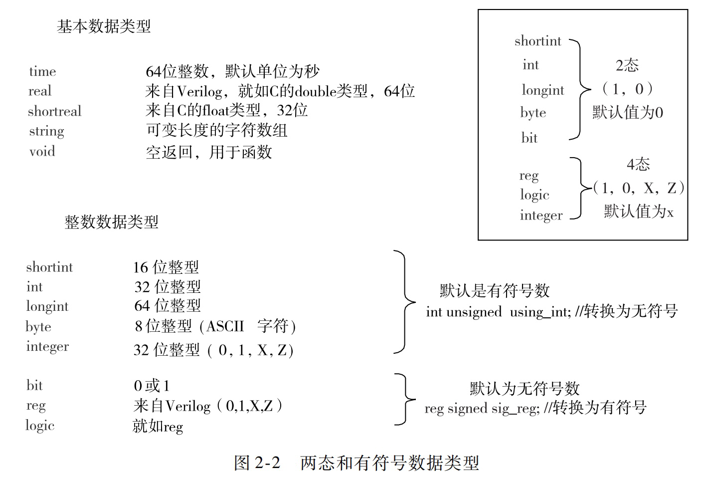

####  数据类型

------

###### 目录

[TOC]

------

##### 两态

Sv 引入了两态的数据类型来减少仿真器对内存的使用和提高仿真的运行效率， 其中 bit 是无符号数， 其他四个是有符号数：short int/int/longint/byte

sv 对 reg的数据类型作了改进， 可以被连续赋值语句、 门逻辑和模块直接驱
动。 另外，sv 还引入了一个新的四态数据类型 logic， 可以代替 reg； 但是不能用在双向总线和多驱动的情况下， 此时只能使用网线类型， 例如 wire.

------

##### 枚举

枚举类型可以用来声明一组整型的命名常量， 定义具有强类型的枚举变量。 枚举类型还可以使用枚举名字而不是枚举值来方便地引用或显示

###### 格式

`enum [data_type] {name1 = value1, name2 = value2···，nameN = valueN} var name;`

当没有指定数据类型的时候， 缺省的数据类型是 int。 在枚举类型中使用的任何其他数据类型都要求显式地声明。

无论是枚举名 还是它们的 （ 整型） 数值都必须是唯一的。 它们的值可以被设置为任意整型常量值， 或者从初始值 ０ 开始递增 （ 默认情况） 。 如果将两个值设置到相同的枚举名， 或者设置的值与递增值冲突都是非法的定义。

枚举类型是一种强类型， 枚举变量在赋值、 传递和关系操作符中进行类型检查， 因此**<u>枚举变量不能被在枚举集合范围以外的数值直接赋值</u>**， 除非使用强制类型转换或者该枚举变量是一个联合体的成员。 枚举变量可以自动转换成整型值， 在表达式中作为常量使用， 并且运算结果也可以赋值到任何一个兼容的整型变量。

###### sv提供的函数操作

